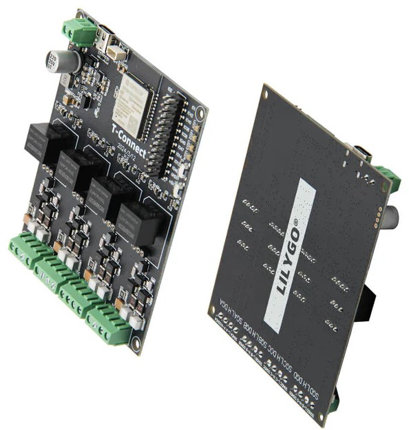
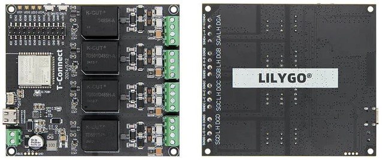
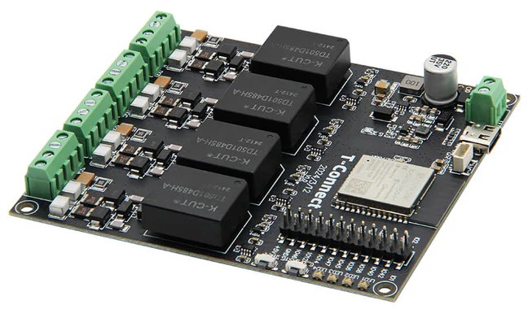
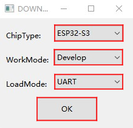

<!--
 * @Description: None
 * @version: V1.0.0
 * @Author: LILYGO_L
 * @Date: 2023-09-11 16:13:14
 * @LastEditors: Please set LastEditors
 * @LastEditTime: 2024-11-20 13:46:02
 * @License: GPL 3.0
-->
<h1 align = "center">T-Connect</h1>

## **[English](./README.md) | 中文**

## 版本迭代:
| Version                               | Update date                       |
| :-------------------------------: | :-------------------------------: |
| T-Connect_V1.0                      | 2024-07-09                         |

## 购买链接

| Product                     | SOC           |  FLASH  |  PSRAM   | Link                   |
| :------------------------: | :-----------: |:-------: | :---------: | :------------------: |
| T-Connect   | ESP32S3R8 |   16M   | 8M (Octal SPI) | [LILYGO Mall](https://lilygo.cc/products/t-connect?_pos=1&_sid=33e78ceb7&_ss=r) |

## 目录
- [描述](#描述)
- [预览](#预览)
- [模块](#模块)
- [快速开始](#快速开始)
- [引脚总览](#引脚总览)
- [相关测试](#相关测试)
- [常见问题](#常见问题)
- [项目](#项目)
- [资料](#资料)
- [依赖库](#依赖库)

## 描述

T-Connect是一款拥有4组不同模块输出数据的板子，支持CAN和RS485两种不同模块相互切换，最大支持三组RS485和一组CAN总线输出不同数据。

## 预览

### 实物图

    

---

    

---

    

## 模块

### 1. MCU

* 芯片：ESP32-S3-R8
* PSRAM：8M (Octal SPI) 
* FLASH：16M
* 其他说明：更多资料请访问[乐鑫官方ESP32-S3数据手册](https://www.espressif.com.cn/sites/default/files/documentation/esp32-s3_datasheet_en.pdf)

### 2. 远距离通信

* 模块：RS485 
* 使用总线通信协议：UART通信

* 模块：CAN
* 使用总线通信协议：TWAI通信

### 3. 板载可编程LED灯

* 芯片：APA102

## 快速开始

### 示例支持

| Example | Support IDE And Version| Description | Picture |
| ------  | ------  | ------ | ------ | 
| [Original Test](./examples/Original_Test) | `[Platformio IDE][espressif32-v6.5.0]` `[Arduino IDE][esp32_v2.0.14]` | 出厂初始测试文件 |  |
| [APA102 Blink](./examples/APA102_Blink) | `[Platformio IDE][espressif32-v6.5.0]` `[Arduino IDE][esp32_v2.0.14]` |  |  |
| [CAN](./examples/CAN) | `[Platformio IDE][espressif32-v6.5.0]` `[Arduino IDE][esp32_v2.0.14]` |  |  |
| [RS485](./examples/RS485) | `[Platformio IDE][espressif32-v6.5.0]` `[Arduino IDE][esp32_v2.0.14]` |  |  |

| Firmware | Description | Picture |
| ------  | ------  | ------ |
| [Original_Test](./firmware/[T-Connect_V1.0][Original_Test]_firmware_V1.0.3.bin) | 出厂初始测试文件 |  |

### PlatformIO
1. 安装[VisualStudioCode](https://code.visualstudio.com/Download)，根据你的系统类型选择安装。

2. 打开VisualStudioCode软件侧边栏的“扩展”（或者使用<kbd>Ctrl</kbd>+<kbd>Shift</kbd>+<kbd>X</kbd>打开扩展），搜索“PlatformIO IDE”扩展并下载。

3. 在安装扩展的期间，你可以前往GitHub下载程序，你可以通过点击带绿色字样的“<> Code”下载主分支程序，也通过侧边栏下载“Releases”版本程序。

4. 扩展安装完成后，打开侧边栏的资源管理器（或者使用<kbd>Ctrl</kbd>+<kbd>Shift</kbd>+<kbd>E</kbd>打开），点击“打开文件夹”，找到刚刚你下载的项目代码（整个文件夹），点击“添加”，此时项目文件就添加到你的工作区了。

5. 打开项目文件中的“platformio.ini”（添加文件夹成功后PlatformIO会自动打开对应文件夹的“platformio.ini”）,在“[platformio]”目录下取消注释选择你需要烧录的示例程序（以“default_envs = xxx”为标头），然后点击左下角的“<kbd>[√](image/4.png)</kbd>”进行编译，如果编译无误，将单片机连接电脑，点击左下角“<kbd>[→](image/5.png)</kbd>”即可进行烧录。

### Arduino
1. 安装[Arduino](https://www.arduino.cc/en/software)，根据你的系统类型选择安装。

2. 打开项目文件夹的“example”目录，选择示例项目文件夹，打开以“.ino”结尾的文件即可打开Arduino IDE项目工作区。

3. 打开右上角“工具”菜单栏->选择“开发板”->“开发板管理器”，找到或者搜索“esp32”，下载作者名为“Espressif Systems”的开发板文件。接着返回“开发板”菜单栏，选择“ESP32 Arduino”开发板下的开发板类型，选择的开发板类型由“platformio.ini”文件中以[env]目录下的“board = xxx”标头为准，如果没有对应的开发板，则需要自己手动添加项目文件夹下“board”目录下的开发板。

4. 打开菜单栏“[文件](image/6.png)”->“[首选项](image/6.png)”，找到“[项目文件夹位置](image/7.png)”这一栏，将项目目录下的“libraries”文件夹里的所有库文件连带文件夹复制粘贴到这个目录下的“libraries”里边。

5. 在 "工具 "菜单中选择正确的设置，如下表所示。

#### ESP32-S3
| Setting                               | Value                                 |
| :-------------------------------: | :-------------------------------: |
| Board                                 | ESP32S3 Dev Module           |
| Upload Speed                     | 921600                               |
| USB Mode                           | Hardware CDC and JTAG     |
| USB CDC On Boot                | Enabled                              |
| USB Firmware MSC On Boot | Disabled                             |
| USB DFU On Boot                | Disabled                             |
| CPU Frequency                   | 240MHz (WiFi)                    |
| Flash Mode                         | QIO 80MHz                         |
| Flash Size                           | 16MB (128Mb)                    |
| Core Debug Level                | None                                 |
| Partition Scheme                | 16M Flash (3MB APP/9.9MB FATFS) |
| PSRAM                                | OPI PSRAM                         |
| Arduino Runs On                  | Core 1                               |
| Events Run On                     | Core 1                               |        

6. 选择正确的端口。

7. 点击右上角“<kbd>[√](image/8.png)</kbd>”进行编译，如果编译无误，将单片机连接电脑，点击右上角“<kbd>[→](image/9.png)</kbd>”即可进行烧录。

### firmware烧录
1. 打开项目文件“tools”找到ESP32烧录工具，打开。

2. 选择正确的烧录芯片以及烧录方式点击“OK”，如图所示根据步骤1->2->3->4->5即可烧录程序，如果烧录不成功，请按住“BOOT-0”键再下载烧录。

3. 烧录文件在项目文件根目录“[firmware](./firmware/)”文件下，里面有对firmware文件版本的说明，选择合适的版本下载即可。

    
    

## 引脚总览

| LED引脚  | ESP32S3引脚|
| :------------------: | :------------------:|
| APA102_DATA         | IO8       |
| APA102_CLOCK         | IO3       |

| CAN和RS485共用引脚  | ESP32S3引脚|
| :------------------: | :------------------:|
| TX_1         | IO4       |
| RX_1         | IO5       |
| TX_2         | IO6       |
| RX_2         | IO7       |
| TX_3         | IO17       |
| RX_3         | IO18       |
| TX_4         | IO9       |
| RX_4         | IO10       |

## 相关测试

### 距离测试
| Board | Program| Description | Picture |
| ------  | ------  | ------ | ------ | 
| `T-Connect_V1.0` | `CAN` | 速度：500KBITS   通信距离：35m | |
| `T-Connect_V1.0` | `RS485` | 波特率：115200  通信距离：35m | |

## 常见问题

* Q. 看了以上教程我还是不会搭建编程环境怎么办？
* A. 如果看了以上教程还不懂如何搭建环境的可以参考[LilyGo-Document](https://github.com/Xinyuan-LilyGO/LilyGo-Document)文档说明来搭建。

 

* Q. 为什么打开Arduino IDE时他会提醒我是否要升级库文件？我应该升级还是不升级？
* A. 选择不升级库文件，不同版本的库文件可能不会相互兼容所以不建议升级库文件。

 

* Q. 为什么我的板子上“Uart”接口没有输出串口数据，是不是坏了用不了啊？
* A. 因为项目文件默认配置将USB接口作为Uart0串口输出作为调试，“Uart”接口连接的是Uart0，不经配置自然是不会输出任何数据的。 PlatformIO用户请打开项目文件“platformio.ini”，将“build_flags = xxx”下的选项“-DARDUINO_USB_CDC_ON_BOOT=true”修改成“-DARDUINO_USB_CDC_ON_BOOT=false”即可正常使用外部“Uart”接口。 Arduino用户打开菜单“工具”栏，选择USB CDC On Boot: “Disabled”即可正常使用外部“Uart”接口。

 

* Q. 为什么我的板子一直烧录失败呢？
* A. 请按住“BOOT-0”按键重新下载程序。

## 项目
* [T-Connect_V1.0](./project/T-Connect_V1.0.pdf)

## 资料
* [TD501D485H-A_K-CUT](./information/TD501D485H-A_K-CUT.pdf)
* [TD501MCANFD_MORNSUN](./information/TD501MCANFD_MORNSUN.pdf)

## 依赖库
* [FastLED-3.6.0](https://github.com/FastLED/FastLED)